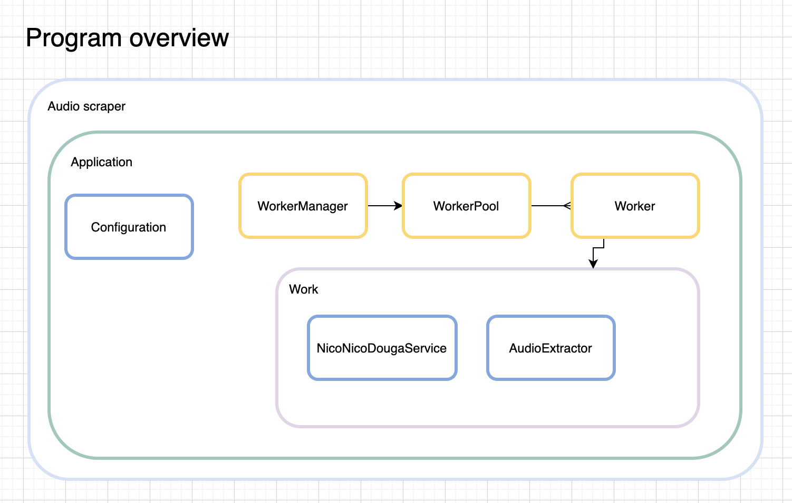

# scraper
- The automation to have fun around web and learn golang

---

# Features

## Audio scraper

### [Draft] Schedule
- Lay foundation for this project
- Create supplemental visual diagrams
- Break down implementation and append them to schedule
- Prepare development environment
  - docker, golang
- [TBD] implementation

### Overview
#### Application

#### Program components

- Application
  - the application service, encapsulates application logic underneath
  - orchestrates components
  - provides interface so that binding can utilize it
- Configuration
  - new with config file path
  - getters for the config values
- NicoNicoDougaService
  - handles login operation
  - handles video page
    - arguments:
      - video page url
    - scrape video title
    - scrape video url
- AudioExtractor
  - extracts audio from video file
    - arguments:
      - path to video file
      - path to mp3 file to save to
- Worker
  - handles executing work
  - notifies when work is done
- WorkerPool
  - stores Workers
  - provides Workers when requested
  - re-stores Workers when given back
- WorkerManager
  - configures
    - quantity of workers to pool
    - quantity of workers to run at a moment
  - start execution of workers
  - notify when work is done
  - should be able to handle errors within Worker
  - should be able to report result
    - how many completed without error
    - how many encountered error

### Specification
- general
  - use golang to program
    - for learning purpose
  - provides standalone executable
  - parse html file to scrape desired content
  - tool to download media file (video)
  - tool to extract audio from video file
- input
  - configuration file in yaml:
    - niconico douga account credential (email, password)
    - urls to the videos that you want to extract audio
- output
  - audio files of the videos given as urls
    - in mp3 format
    - file name to be title of video
    - save them to designated location
- misc
  - respective work should be done concurrently
    - scraping should be done concurrently for performance (and learning golang)

### Draft implementation
- execute program with configuration file
- read configuration file to:
  - store:
    - accountEmail: string ... account email
    - password: string ... password
    - mediaUrls: []string ... urls to extract audios
    - outputPath: string ... path to directory under which audio files will be saved
- for url of urls: (ideally work here should be done concurrently)
  - open niconico login page
  - input account email and password, and proceed with login
  - confirm login succeeded
  - open the url
  - (probably) deal with advertisement
  - traverse page to:
    - store:
      - video title (should be in original title, not in wrongly wron translation. what is wrong with those machine translations?)
      - video source url
  - download video from the video source url
    - probably should write it to disk to optimize memory usage?
    - store:
      - video media file
  - extract audio file from video media file
    - probably should write it to disk?
    - store:
      - audio media file
  - set video title to audio media file's name
  - move audio media file to designated location

### Requirements
- golang
  - language itself
  - browser automation library
    - will have to simulate user login
    - should be able to handle cookie?
    - probably will have to deal with advertisement, before extracting video url?
  - html parser
    - should give functionality to ease traversing html file
      - extract text from provided css selector
      - extract html attribute from given element (to extract video url)
  - library to extract audio from video
    - should be able to put it to mp3
    - and save it as file
- docker
  - gives portable execution environment for program

---

# Todo
## Backlog
- [x] create visual diagram to describe program architecture
  - overview of program, relationships among them
- [ ] consider architecture of implementation and create visual diagram
  - [ ] sequence diagram
  - [x] components diagram
- [ ] research if extracting audio for personal use conflict with dwango's terms of use

### Done
- [x] lay foundation for audio scraper
  - [x] fill out specification
  - [x] fill out requirements
  - [x] fill out draft implementation
  - [x] create draft schedule
