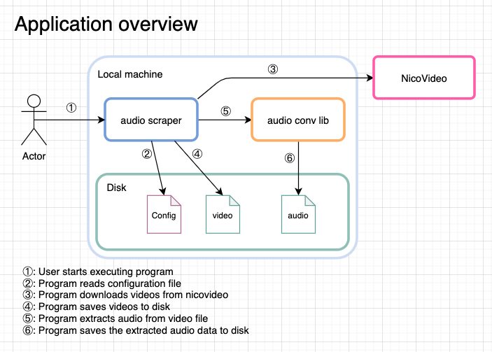
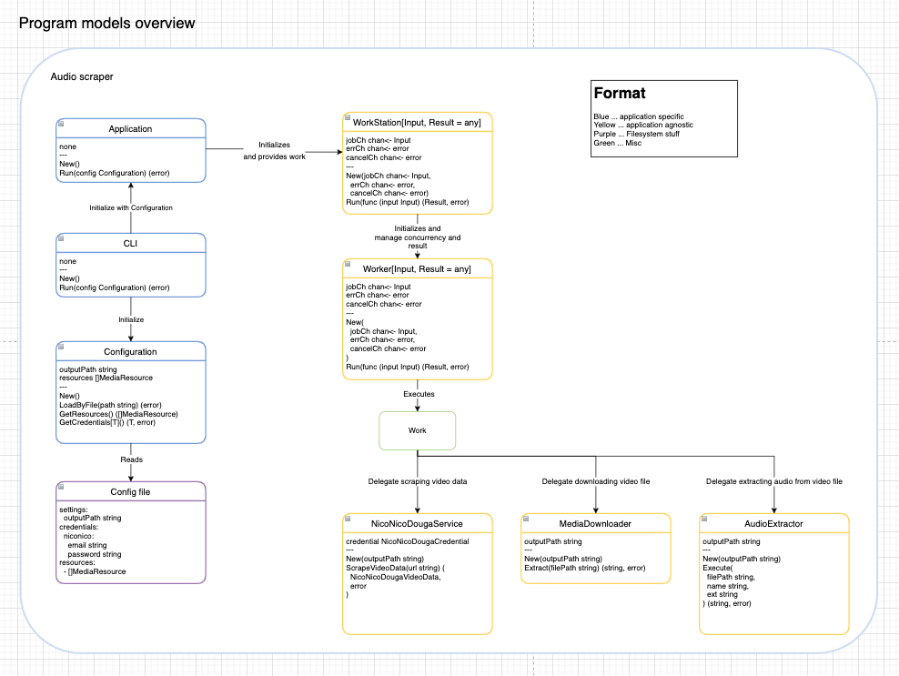

# audioscraper
- An automation to aggregate audio files from various sources.

# Specification
- general
  - use golang to program
    - for learning purpose
  - provides standalone executable
  - parse html file to scrape desired content
  - tool to download media file (video)
  - tool to extract audio from video file
- input
  - configuration file in yaml:
    - niconico douga account credential (email, password)
    - urls to the videos that you want to extract audio
- output
  - audio files of the videos given as urls
    - in mp3 format
    - file name to be title of video
    - save them to designated location
- misc
  - respective work should be done concurrently
    - scraping should be done concurrently for performance (and learning golang)

# Requirements
- golang
  - language itself
  - browser automation library
    - will have to simulate user login
    - should be able to handle cookie?
    - probably will have to deal with advertisement, before extracting video url?
  - html parser
    - should give functionality to ease traversing html file
      - extract text from provided css selector
      - extract html attribute from given element (to extract video url)
  - library to extract audio from video
    - should be able to put it to mp3
    - and save it as file
  - use generics
    - To write more effective code
    - To learn what it exactly is in golang world
- docker
  - gives portable execution environment for program

# Consideration
- Probably I should create a niconico douga account which can be banned without concern
  - it is pretty much possible that their system detect this program as bot and ban the account
  - do not want to lose the beloved account
- Should codes juggle files around with file handler instead of passing file path?
  - is a matter of:
    - execution performance
    - codebase organization for simplicity and decoupleness
- what exactly is the Application's responsibility?
  - handle pallelization, or just provide the work itself and let client code parallelization?
- will have to consider module structure
  - or not really?
    - just put everything in one module?

# Schedule
- Lay foundation for this project
- Create supplemental visual diagrams
- Break down implementation and append them to schedule
- Prepare development environment
  - docker, golang
- [TBD] implementation

# Overview
- [Audio scraper diagrams](audio-scraper-design.drawio)

## Application

## Program components

### Application models
- Application
  - the application service, encapsulates application logic underneath
  - orchestrates components
  - provides interface so that in adapters can utilize this
  - new arguments:
    - none
  - properties:
    - none
  - methods:
    - none
- Configuration
  - retrieve and manage configuration
    - provide configuration values as required
  - new arguments:
    - none
  - properties:
    - outputPath string
      - path to output folder which is used by default to emit artifacts to.
    - resources []MediaResource
      - slices of resources to download and convert to store on disk.
  - methods:
    - LoadByConfigPath(path string) (err)
      - Loads configuration by reading config file specified by the path given
    - AppendResources(resources []MediaResource)
      - appends resources data to internal resources property.
    - GetResources() []MediaResource
      - returns the resources
    - GetNicoNicoDougaCredentials(resource MediaResource) (email string, password string)

## Application agnostic models
- Worker[Input, Result = any]
  - handles executing work
  - receives work (input) via channel given
  - notifies when work is done
  - new arguments:
    - jobCh chan Input
    - errCh chan error
    - cancelCh chan error
  - properties:
    - jobCh chan Input
    - errCh chan error
    - cancelCh chan error
  - methods:
    - Run (func (input Input) (Result, error))
      - accepts actual work
- WorkStation[Input, Result = any]
  - configures
    - quantity of workers to run at a moment
  - start execution of workers
  - notify when work is done
  - should be able to handle errors within Worker
  - should be able to report result
    - how many completed without error
    - how many encountered error
  - new arguments:
    - workerQty int
    - results 
    - errors []errors
  - properties:
    - workersQty int
  - methods:
    - TBD no idea
- AudioExtractor
  - extract audio file from some kind of media
  - properties:
    - defaultOutputPath
  - methods:
    - SetDefaultOutputPath(path string)
      - sets default output path
    - Extract(filePath string, name string, ext string) (path string, err error)
- MediaDownloader
  - handles downloading media files to specified location
  - new arguments:
    - none?
  - properties:
    - defaultOutputPath string
  - methods:
    - SetDefaultOutputPath string
      - sets default output path to the location where this model downloads file to
    - Download(url string) (location string, err error)
      - downloads media file, and returns the file location path and error if any
- NicoNicoDougaService
  - provides niconico douga specific operations
  - concern:
    - probably the browser automation tool should be injected
  - new arguments:
    - email string
    - password string
  - properties:
    - none?
  - methods:
    - ScrapeVideoData(url string) (NicoNicoDougaVideoData, error)
      - handles login operation
      - handles scraping video page

## Application agnostic data structures
- MediaResource
  - holds data to describe media resource from various video services
  - new arguments:
    - provider "niconico"
    - url string
  - properties:
    - Provider "niconico"
- NicoNicoDougaVideoData
  - holds aggregated video data
  - properties:
    - mediaUrl string
    - title string

## Others
- Config yaml file
  - settings:
    - outputPath string
  - credentials:
    - niconico:
      - email string
      - password string
  - resources:
    - []MediaResource

# Draft implementation
- execute program with configuration file
- read configuration file to:
  - store:
    - accountEmail: string ... account email
    - password: string ... password
    - mediaUrls: []string ... urls to extract audios
    - outputPath: string ... path to directory under which audio files will be saved
- for url of urls: (ideally work here should be done concurrently)
  - open niconico login page
  - input account email and password, and proceed with login
  - confirm login succeeded
  - open the url
  - (probably) deal with advertisement
  - traverse page to:
    - store:
      - video title (should be in original title, not in wrongly wron translation. what is wrong with those machine translations?)
      - video source url
  - download video from the video source url
    - probably should write it to disk to optimize memory usage?
    - store:
      - video media file
  - extract audio file from video media file
    - probably should write it to disk?
    - store:
      - audio media file
  - set video title to audio media file's name
  - move audio media file to designated location
