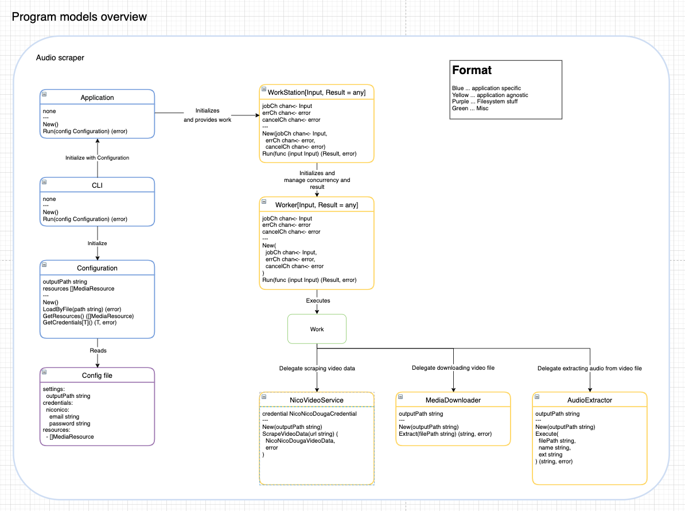
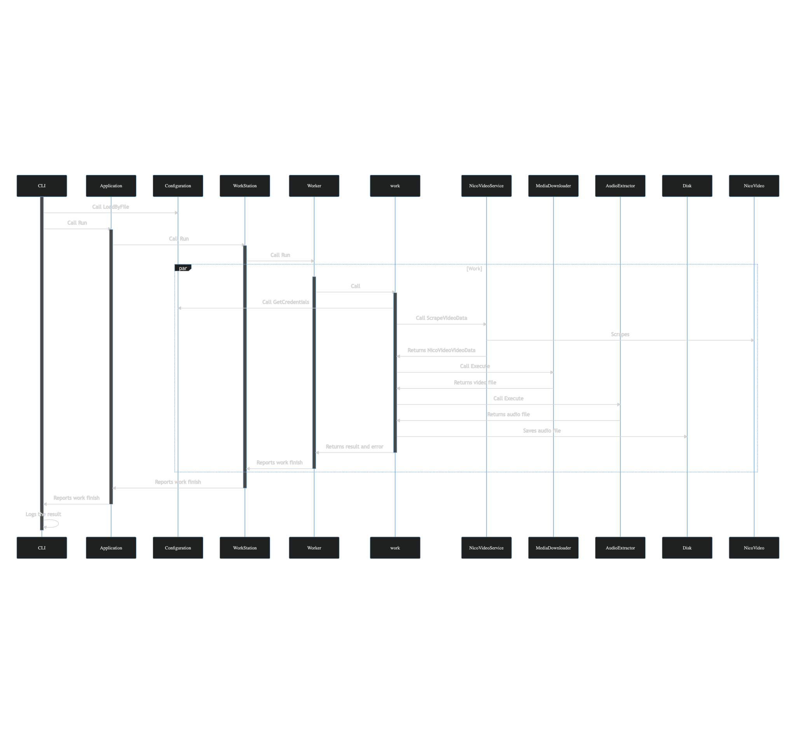

# audioscraper
- An automation to aggregate audio files from various sources.

# Schedule
- Lay foundation for this project
- Create supplemental visual diagrams
- Break down implementation and append them to schedule
- Prepare development environment
  - docker, golang
- [TBD] implementation

# Specification
- general
  - use golang to program
    - for learning purpose
  - provides standalone executable
  - parse html file to scrape desired content
  - tool to download media file (video)
  - tool to extract audio from video file
- input
  - configuration file in yaml:
    - niconico douga account credential (email, password)
    - urls to the videos that you want to extract audio
- output
  - audio files of the videos given as urls
    - in mp3 format
    - file name to be title of video
    - save them to designated location
- misc
  - respective work should be done concurrently
    - scraping should be done concurrently for performance (and learning golang)

# Requirements
- golang
  - language itself
  - browser automation library
    - will have to simulate user login
    - should be able to handle cookie?
    - probably will have to deal with advertisement, before extracting video url?
  - html parser
    - should give functionality to ease traversing html file
      - extract text from provided css selector
      - extract html attribute from given element (to extract video url)
  - library to extract audio from video
    - should be able to put it to mp3
    - and save it as file
  - use generics
    - To write more effective code
    - To learn what it exactly is in golang world
- docker
  - gives portable execution environment for program

# Consideration
- Probably I should create a niconico douga account which can be banned without concern
  - it is pretty much possible that their system detect this program as bot and ban the account
  - do not want to lose the beloved account
- Should codes juggle files around with file handler instead of passing file path?
  - is a matter of:
    - execution performance
    - codebase organization for simplicity and decoupleness
- what exactly is the Application's responsibility?
  - handle pallelization, or just provide the work itself and let client code parallelization?
- will have to consider module structure
  - or not really?
    - just put everything in one module?

# Draft implementation
- execute program with configuration file
- read configuration file to:
  - store:
    - accountEmail: string ... account email
    - password: string ... password
    - mediaUrls: []string ... urls to extract audios
    - outputPath: string ... path to directory under which audio files will be saved
- for url of urls: (ideally work here should be done concurrently)
  - open niconico login page
  - input account email and password, and proceed with login
  - confirm login succeeded
  - open the url
  - (probably) deal with advertisement
  - traverse page to:
    - store:
      - video title (should be in original title, not in wrongly wron translation. what is wrong with those machine translations?)
      - video source url
  - download video from the video source url
    - probably should write it to disk to optimize memory usage?
    - store:
      - video media file
  - extract audio file from video media file
    - probably should write it to disk?
    - store:
      - audio media file
  - set video title to audio media file's name
  - move audio media file to designated location

# Overview
- [Audio scraper diagrams](audio-scraper-design.drawio)

## Application

## Program components

### CLI binding
- just provide function
- parse the argument
- configure and run application
- writes to the standard output when thing done
- writes to the standard error when things gone bad

### Application models
- Application
  - the application service, encapsulates application logic underneath
  - orchestrates components
  - provides interface so that in adapters can utilize this
  - new arguments:
    - none
  - properties:
    - none
  - methods:
    - Run(config Configuration) (error)
- Configuration
  - retrieve and manage configuration
  - provide configuration values as required
  - new arguments:
    - none
  - properties:
    - outputPath string
      - path to output folder which is used by default to emit artifacts to.
    - resources []MediaResource
      - slices of resources to download and convert to store on disk.
  - methods:
    - LoadByFile(path string) (err)
      - Loads configuration by reading config file specified by the path given
    - GetResources() []MediaResource
      - returns the resources
    - GetCredentials[T]() (T, error)
      - can golang do type assertion with type argument?
      - if so, asserts the type to return corresponding credentials
        - if not credential not found, return error

### Application agnostic models
- Worker[Input, Result = any]
  - handles executing work
  - receives work (input) via channel given
  - notifies when work is done
  - new arguments:
    - jobCh chan<- Input
    - errCh chan<- error
    - cancelCh chan<- error
  - properties:
    - jobCh chan Input
    - errCh chan error
    - cancelCh chan error
  - methods:
    - Run (func (input Input) (Result, error))
      - accepts actual work
- WorkStation[Input, Result = any]
  - configures
    - quantity of workers to run at a moment
  - start execution of workers
  - notify when work is done
  - should be able to handle errors within Worker
  - should be able to report result
    - how many completed without error
    - how many encountered error
  - new arguments:
    - none
  - properties:
    - workersQty int
    - results []Result
    - errors []error
  - methods:
    - SetWorkerQty(qty int)
    - RegisterWork(func (input Input) (Result, error))
    - Run()
    - Done() (chan<- error)
      - returns channel which emits when work is done
    - Terminate() (error)
      - terminates underlying works
- AudioExtractor
  - extract audio file from some kind of media
  - new arguments:
    - outputPath string
  - properties:
    - outputPath string
  - methods:
    - Execute(filePath string, name string, ext string) (path string, err error)
- MediaDownloader
  - handles downloading media files to specified location
  - new arguments:
    - outputPath string
  - properties:
    - outputPath string
  - methods:
    - Execute(url string) (locationPath string, err error)
      - downloads media file, and returns the file location path and error if any
- NicoVideoService
  - provides niconico douga specific operations
  - concern:
    - probably the browser automation tool should be injected
  - new arguments:
    - credential NicoVideoCredential
  - properties:
    - credential NicoVideoCredential
  - methods:
    - ScrapeVideoData(url string) (NicoVideoVideoData, error)
      - handles login operation
      - handles scraping video page

### Application agnostic data structures
- MediaResource
  - holds data to describe media resource from various video services
  - new arguments:
    - provider "niconico"
    - url string
  - properties:
    - provider "niconico"
  - methods:
    - GetProvider() (string)
    - GetUrl() (string)
- NicoVideoVideoData
  - holds aggregated video data
  - properties:
    - mediaUrl string
    - title string
  - methods:
    - GetMediaUrl() (string)
    - GetTitle() (string)
- NicoVideoCredential
  - new arguments:
    - email string
    - password string
  - properties
    - email string
    - password string
  - methods:
    - GetEmail() (string)
    - GetPassword() (string)

### Errors
- ConfigurationFileNotFound
  - when Configuration failed to find a config file specified with path
- ConfigurationFileInvalid
  - when config file format is invalid
- InvalidCredentialRequest
  - when Configuration failed to get credential for the type argument given

### Others
- Config yaml file
  - settings:
    - outputPath string
  - credentials:
    - niconico:
      - email string
      - password string
  - resources:
    - []MediaResource

## Program execution flow
- [Audio scraper sequence diagram](audio-scraper-execution-flow.mmd)
- [Mermaid](https://mermaid.live/edit/#eyJjb2RlIjoic2VxdWVuY2VEaWFncmFtXG4gICAgJSUgbW9kZWxzXG4gICAgcGFydGljaXBhbnQgQ0xJXG4gICAgcGFydGljaXBhbnQgQXBwIGFzIEFwcGxpY2F0aW9uXG4gICAgcGFydGljaXBhbnQgQ29uZmlnIGFzIENvbmZpZ3VyYXRpb25cbiAgICBwYXJ0aWNpcGFudCBXUyBhcyBXb3JrU3RhdGlvblxuICAgIHBhcnRpY2lwYW50IFdyIGFzIFdvcmtlclxuICAgIHBhcnRpY2lwYW50IHcgYXMgd29ya1xuICAgIHBhcnRpY2lwYW50IG5jc3ZjIGFzIE5pY29WaWRlb1NlcnZpY2VcbiAgICBwYXJ0aWNpcGFudCBNRCBhcyBNZWRpYURvd25sb2FkZXJcbiAgICBwYXJ0aWNpcGFudCBBRSBhcyBBdWRpb0V4dHJhY3RvclxuICAgICUlIGV4dGVybmFsXG4gICAgcGFydGljaXBhbnQgRCBhcyBEaXNrXG4gICAgcGFydGljaXBhbnQgbmN2ZCBhcyBOaWNvVmlkZW9cblxuICAgICUlIC0tLS0tLS0tLS0gRXhlY3V0aW9uIGZsb3cgLS0tLS0tLS0tLVxuICAgICUlIEluaXRpYWxpemF0aW9uIGJ5IGFkYXB0ZXJcbiAgICBhY3RpdmF0ZSBDTElcbiAgICBDTEktPj5Db25maWc6IENhbGwgTG9hZEJ5RmlsZVxuICAgIENMSS0-PkFwcDogQ2FsbCBSdW5cblxuICAgICUlIEFwcGxpY2F0aW9uIGZsb3dcbiAgICBhY3RpdmF0ZSBBcHBcbiAgICBBcHAtPj5XUzogQ2FsbCBSdW5cbiAgICBhY3RpdmF0ZSBXU1xuICAgIFdTLT4-V3I6IENhbGwgUnVuXG4gICAgcGFyIFdvcmtcbiAgICAgICAgYWN0aXZhdGUgV3JcbiAgICAgICAgV3ItPj53OiBDYWxsXG4gICAgICAgIGFjdGl2YXRlIHdcbiAgICAgICAgdy0-PkNvbmZpZzogQ2FsbCBHZXRDcmVkZW50aWFsc1xuICAgICAgICB3LT4-bmNzdmM6IENhbGwgU2NyYXBlVmlkZW9EYXRhXG4gICAgICAgIG5jc3ZjLT4-bmN2ZDogU2NyYXBlc1xuICAgICAgICBuY3N2Yy0-Pnc6IFJldHVybnMgTmljb1ZpZGVvVmlkZW9EYXRhXG4gICAgICAgIHctPj5NRDogQ2FsbCBFeGVjdXRlXG4gICAgICAgIE1ELT4-dzogUmV0dXJucyB2aWRlbyBmaWxlXG4gICAgICAgIHctPj5BRTogQ2FsbCBFeGVjdXRlXG4gICAgICAgIEFFLT4-dzogUmV0dXJucyBhdWRpbyBmaWxlXG4gICAgICAgIHctPj5EOiBTYXZlcyBhdWRpbyBmaWxlXG4gICAgICAgIHctPj5XcjogUmV0dXJucyByZXN1bHQgYW5kIGVycm9yXG4gICAgICAgIGRlYWN0aXZhdGUgd1xuICAgICAgICBXci0-PldTOiBSZXBvcnRzIHdvcmsgZmluaXNoXG4gICAgICAgIGRlYWN0aXZhdGUgV3JcbiAgICBlbmRcbiAgICBXUy0-PkFwcDogUmVwb3J0cyB3b3JrIGZpbmlzaFxuICAgIGRlYWN0aXZhdGUgV1NcbiAgICBBcHAtPj5DTEk6IFJlcG9ydHMgd29yayBmaW5pc2hcbiAgICBkZWFjdGl2YXRlIEFwcFxuICAgIENMSS0-PkNMSTogTG9ncyB0aGUgcmVzdWx0XG4gICAgZGVhY3RpdmF0ZSBDTEkiLCJtZXJtYWlkIjoie1xuICBcInRoZW1lXCI6IFwiZGFya1wiLFxuICBcImRpYWdyYW1NYXJnaW5YXCI6IDUwXG59IiwidXBkYXRlRWRpdG9yIjpmYWxzZSwiYXV0b1N5bmMiOnRydWUsInVwZGF0ZURpYWdyYW0iOmZhbHNlfQ)

